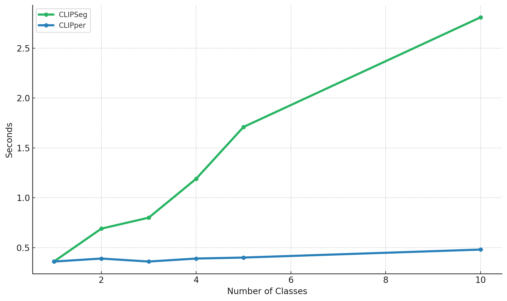

# CLIPper

CLIPper is a reimplementation of CLIPseg, optimized for better performance for
multi-class segmentation. The previous implementations both on the original
CLIPseg [repo](https://github.com/timojl/clipseg) and [hugginface](https://github.com/huggingface/transformers/tree/main/src/transformers/models/clipseg)
both require an in image for each text input. If you want to segment multiple
classes for the same image you need to encode the image for each text input.

CLIPper fixes this by encoding the image only once and then encoding each text unput,
and decoding for text input. The image encoder is the bulk of the inference time,
so doing this once leads to great speed ups as you add classes, as shown in plot.

I do hope to commit this back to Huggingface, if they'll take it. I'm also working
on a cpp implementation.

# ToDos
1. Add pooling to cpp text processor
2. Write the model in cpp
3. Test model
